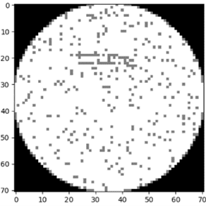
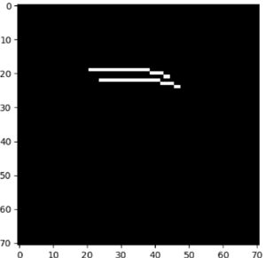
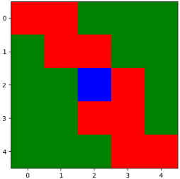

# Scratch Detection Assignment by Gal Alon

To address the problem of scratch detection, I began by developing a wafer-level classification approach to gain a better understanding of the data. 
Specifically, I used a Random Forest model to conduct a series of experiments, which can be found in "experiments_wafer_level_classification.ipynb". 
After refining the approach, I arrived at a final version of the classification model, which can be found in "final_wafer_classification.ipynb".

After conducting experiments with a Random Forest model at the wafer level, I was able to achieve an accuracy of approximately 0.95. 
Since the data was balanced during this stage, I believe that these measurements provide good validation for the model's performance.

After achieving success with wafer-level classification, I shifted my focus to detecting scratches at the die level and identifying patterns. 
To tackle this challenge, I decided to transform the tabular data into image-like data. 
Specifically, I classified each die based on its surrounding dies within a specified radius, enabling me to use a classic binary classification model while maintaining the relationships between neighboring dies.

 

As an example, consider a case where the radius is set to 5. 
In this scenario, we would examine the area around the middle die (marked in blue as a scratch in the data). 
The green dies represent good dies, while the red dies represent bad dies. 
Based on this data, we can represent the image-like data as x = [[1, 1, 0, 0, 0], [0, 1, 1, 0, 0], [0, 0, 2, 1, 0], [0, 0, 1, 1, 0], [0, 0, 0, 1, 1]]  (flattened), and the corresponding label as y = 1.

To train the model for detecting scratches at the die level, I chose to use LightGBM because of the limited number of features and its ability to handle unbalanced data. Additionally, LightGBM is known for its high performance in classification tasks and can handle large datasets efficiently. During the training process, I used balanced data to help the model learn and understand the data. Through this approach, I was able to achieve an accuracy of up to 0.93 on random test data and up to 0.89 on balanced test data.
As mentioned previously, I conducted experiments for detecting scratches at the die level, and the results can be found in the "experiments_die_classification.ipynb" notebook. The final results are presented in the "final_die_classification.ipynb" notebook.
The predictions made on the given test data have been saved as asked as a CSV file called "predictions.csv".

